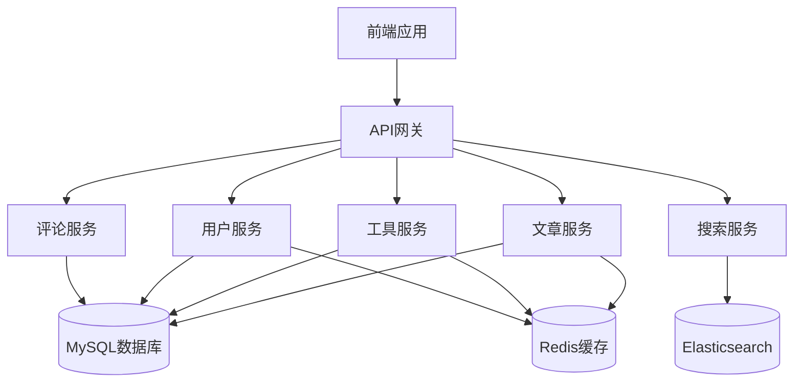

# 博客网站开发计划

## 一、需求分析

### 1. 核心功能

* 文章管理：发布、编辑、删除、查看，支持Markdown格式

* 工具分享：发布、编辑、删除、查看各类工具

* 用户系统：注册、登录、个人信息管理

* 评论系统：文章和工具的评论功能

* 搜索功能：支持文章和工具的关键词搜索

* 分类标签：文章和工具的分类与标签管理

* 首页展示：文章列表、工具列表、热门推荐

### 2. 参考网站

* <https://www.30aitool.com/（工具分享类网站）>

## 二、技术选型

### 1. 前端技术栈

| 技术           | 版本    | 用途          |
| ------------ | ----- | ----------- |
| Vue          | 3.4.x | 前端框架        |
| TypeScript   | 5.x   | 类型安全        |
| Vite         | 5.x   | 构建工具        |
| Pinia        | 2.x   | 状态管理        |
| Vue Router   | 4.x   | 路由管理        |
| Axios        | 1.x   | HTTP请求      |
| Element Plus | 2.6.x | UI组件库       |
| Vditor       | 3.x   | Markdown编辑器 |
| SCSS         | 1.x   | CSS预处理器     |

### 2. 后端技术栈

| 技术              | 版本     | 用途    |
| --------------- | ------ | ----- |
| Spring Boot     | 4.0.x  | 后端框架  |
| JDK             | 25     | 开发环境  |
| MyBatis-Plus    | 3.5.x  | ORM框架 |
| MySQL           | 8.0    | 数据库   |
| Redis           | 7.x    | 缓存    |
| JWT             | 0.11.x | 身份认证  |
| Swagger/OpenAPI | 4.0.x  | API文档 |
| Maven           | 3.9.x  | 构建工具  |

## 三、架构设计

### 1. 系统架构



### 2. 目录结构

#### 前端目录

```
frontend/
├── src/
│   ├── assets/          # 静态资源
│   ├── components/      # 通用组件
│   ├── composables/     # 组合式函数
│   ├── layouts/         # 布局组件
│   ├── pages/           # 页面组件
│   │   ├── Article/     # 文章相关页面
│   │   ├── Tool/        # 工具相关页面
│   │   ├── User/        # 用户相关页面
│   │   └── Home/        # 首页
│   ├── router/          # 路由配置
│   ├── stores/          # 状态管理
│   ├── services/        # API服务
│   ├── utils/           # 工具函数
│   ├── types/           # TypeScript类型定义
│   ├── App.vue          # 根组件
│   └── main.ts          # 入口文件
├── public/              # 公共资源
├── index.html           # HTML模板
├── vite.config.ts       # Vite配置
├── tsconfig.json        # TypeScript配置
└── package.json         # 项目依赖
```

#### 后端目录

```
backend/
├── src/
│   ├── main/
│   │   ├── java/
│   │   │   └── com/
│   │   │       └── blog/
│   │   │           ├── BlogApplication.java    # 应用入口
│   │   │           ├── config/                  # 配置类
│   │   │           ├── controller/              # 控制器
│   │   │           ├── service/                 # 服务层
│   │   │           ├── mapper/                  # 数据访问层
│   │   │           ├── entity/                  # 实体类
│   │   │           ├── dto/                     # 数据传输对象
│   │   │           ├── vo/                      # 视图对象
│   │   │           ├── enums/                   # 枚举类
│   │   │           ├── exception/               # 异常处理
│   │   │           └── utils/                   # 工具类
│   │   └── resources/
│   │       ├── application.yml                 # 应用配置
│   │       ├── mapper/                         # MyBatis映射文件
│   │       └── static/                         # 静态资源
│   └── test/                                   # 测试代码
├── pom.xml                                     # Maven配置
└── README.md                                   # 项目说明
```

## 四、数据库设计

### 1. 核心表结构

#### 用户表（user）

* id: 主键

* username: 用户名

* password: 密码（加密存储）

* email: 邮箱

* nickname: 昵称

* avatar: 头像

* bio: 个人简介

* created\_at: 创建时间

* updated\_at: 更新时间

#### 文章表（article）

* id: 主键

* title: 标题

* content: 内容（Markdown格式）

* html\_content: 转换后的HTML内容

* summary: 摘要

* cover\_image: 封面图片

* user\_id: 作者ID（外键）

* category\_id: 分类ID（外键）

* view\_count: 浏览量

* comment\_count: 评论数

* status: 状态（发布/草稿）

* created\_at: 创建时间

* updated\_at: 更新时间

#### 工具表（tool）

* id: 主键

* name: 工具名称

* description: 描述

* url: 工具链接

* cover\_image: 封面图片

* user\_id: 作者ID（外键）

* category\_id: 分类ID（外键）

* view\_count: 浏览量

* comment\_count: 评论数

* status: 状态（发布/草稿）

* created\_at: 创建时间

* updated\_at: 更新时间

#### 分类表（category）

* id: 主键

* name: 分类名称

* type: 类型（文章/工具）

* parent\_id: 父分类ID

* created\_at: 创建时间

#### 标签表（tag）

* id: 主键

* name: 标签名称

* created\_at: 创建时间

#### 评论表（comment）

* id: 主键

* content: 评论内容

* user\_id: 用户ID（外键）

* target\_id: 目标ID（文章ID或工具ID）

* target\_type: 目标类型（文章/工具）

* parent\_id: 父评论ID

* created\_at: 创建时间

## 五、功能模块划分

### 1. 前端功能模块

| 模块   | 主要功能                     |
| ---- | ------------------------ |
| 首页   | 文章列表、工具列表、热门推荐、搜索框       |
| 文章管理 | 文章列表、发布文章、编辑文章、删除文章、文章详情 |
| 工具管理 | 工具列表、发布工具、编辑工具、删除工具、工具详情 |
| 用户中心 | 个人信息管理、我的文章、我的工具、我的收藏    |
| 评论系统 | 发表评论、回复评论、删除评论           |
| 登录注册 | 用户注册、登录、忘记密码             |

### 2. 后端功能模块

| 模块   | 主要功能              |
| ---- | ----------------- |
| 用户服务 | 用户注册、登录、信息管理、权限验证 |
| 文章服务 | 文章CRUD、分类管理、标签管理  |
| 工具服务 | 工具CRUD、分类管理、标签管理  |
| 评论服务 | 评论CRUD、评论统计       |
| 搜索服务 | 文章搜索、工具搜索         |
| 统计服务 | 浏览量统计、热门推荐        |

## 六、开发计划

### 1. 准备阶段

* 环境搭建：JDK 25、MySQL 8.0、Redis 7.x

* 项目初始化：前端Vue3项目、后端Spring Boot项目

* 数据库设计：创建数据库和表结构

### 2. 后端开发

* 基础框架搭建：Spring Boot配置、MyBatis-Plus集成

* 用户服务开发：注册、登录、JWT认证

* 文章服务开发：CRUD操作、分类标签管理

* 工具服务开发：CRUD操作、分类标签管理

* 评论服务开发：CRUD操作

* 搜索服务开发：Elasticsearch集成

### 3. 前端开发

* 基础框架搭建：Vue3 + TypeScript + Vite

* 组件开发：通用组件、布局组件

* 页面开发：

  * 首页、文章列表、文章详情

  * 工具列表、工具详情

  * 发布文章、编辑文章

  * 发布工具、编辑工具

  * 用户中心、登录注册

* Markdown编辑器集成

### 4. 测试与部署

* 单元测试：前后端单元测试

* 集成测试：接口集成测试

* 性能测试：负载测试、压力测试

* 部署：Docker容器化部署、CI/CD配置

## 七、关键技术点

1. **Markdown支持**：集成Vditor编辑器，实现Markdown实时预览和HTML转换
2. **JWT认证**：实现无状态身份验证，支持单点登录
3. **Redis缓存**：缓存热门文章、工具和用户信息，提高性能
4. **Elasticsearch搜索**：实现高效的全文搜索功能
5. **响应式设计**：适配不同屏幕尺寸，提供良好的移动端体验
6. **TypeScript类型安全**：提高代码质量和开发效率
7. **RESTful API设计**：遵循RESTful规范，提供清晰的API文档

## 八、项目管理

* 使用Git进行版本控制

* 采用敏捷开发方式，分 sprints 进行开发

* 使用Jira或Trello进行任务管理

* 定期召开站会，跟踪项目进度

* 代码审查：使用GitHub Pull Request进行代码审查

## 九、后续优化方向

1. 引入CDN加速静态资源
2. 实现文章和工具的点赞功能
3. 添加社交分享功能
4. 实现消息通知系统
5. 引入数据分析，提供用户行为分析
6. 支持多语言国际化
7. 优化移动端体验
8. 引入AI辅助写作功能

