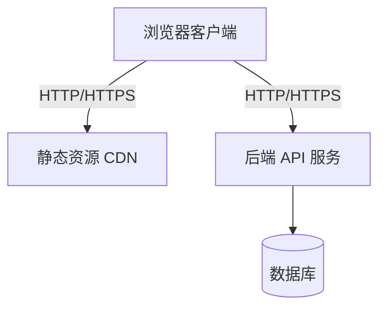
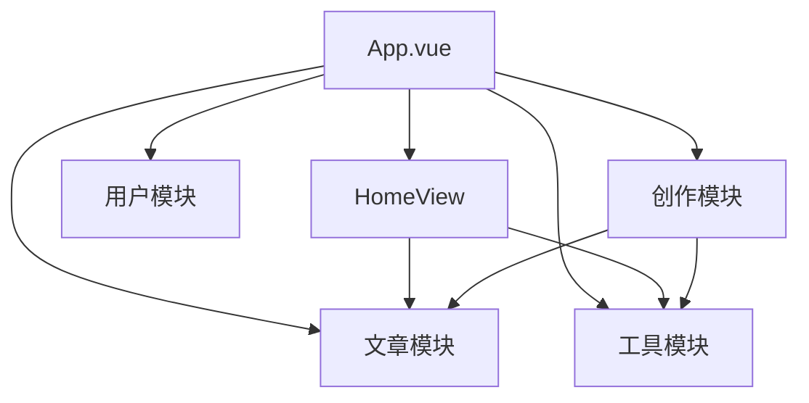

# M Blog 设计规范文档

## 一、项目简介

### 1.1 项目名称
M Blog - 技术博客与工具分享平台

### 1.2 背景与目标
M Blog 是一个面向开发者的技术博客与工具分享平台，旨在帮助开发者记录技术足迹、分享实用工具、促进知识交流与成长。平台提供文章发布、阅读、评论以及工具分享等功能。

### 1.3 业务边界与不做清单
**在范围内：**
- 技术文章发布与阅读
- 工具分享与管理
- 用户评论与互动
- 响应式多端适配

**不在范围内：**
- 复杂的用户权限系统
- 付费内容
- 社交粉丝系统

### 1.4 关键用户/角色
- 技术博主与内容创作者
- 开发者与学习者
- 工具爱好者

### 1.5 当前阶段与里程碑
- **V1.0**: 完成核心 UI 优化与设计系统建设
- **后续**: 用户系统完善、社交功能扩展

## 二、项目目录

```
blog-frontend/
├── public/
├── src/
│   ├── components/
│   │   ├── Icon.vue          # 图标组件
│   │   └── Logo.vue          # LOGO 组件
│   ├── views/
│   │   ├── HomeView.vue           # 首页
│   │   ├── ArticleDetailView.vue  # 文章详情页
│   │   ├── LoginView.vue          # 登录页
│   │   ├── RegisterView.vue       # 注册页
│   │   ├── ToolListView.vue       # 工具列表页
│   │   ├── ToolDetailView.vue     # 工具详情页
│   │   ├── WriteArticleView.vue   # 写文章页
│   │   └── ShareToolView.vue      # 分享工具页
│   ├── App.vue                # 应用入口组件
│   ├── main.ts                # 应用入口文件
│   ├── router/index.ts        # 路由配置
│   ├── store/index.ts         # 状态管理
│   ├── utils/axios.ts         # HTTP 请求封装
│   ├── style.css              # 全局样式
│   ├── design-tokens.css      # 设计令牌
│   └── typescript.svg
├── index.html
├── package.json
├── vite.config.ts
├── tsconfig.json
└── README.md
```

## 三、架构总览

### 3.1 架构风格
- **运行时形态**: 单页应用 (SPA)
- **框架选型**: Vue 3 + TypeScript + Vite
- **UI 框架**: Element Plus
- **状态管理**: Pinia
- **路由管理**: Vue Router

### 3.2 技术决策摘要
- 使用 Vite 作为构建工具，提升开发体验
- 采用 Composition API 进行组件开发
- 集成 Element Plus 组件库加速开发
- 使用 CSS Custom Properties 实现主题切换

### 3.3 系统拓扑图



### 3.4 主要组件与职责
- **App.vue**: 应用布局容器，包含头部导航、主内容区域、底部页脚
- **Logo.vue**: 品牌 LOGO 组件，支持多种变体
- **Icon.vue**: 统一图标组件，提供 20+ 常用图标
- **Views**: 各业务页面组件

## 四、模块说明

### 4.1 模块清单

| 模块 | 职责 | 暴露接口/依赖 |
|------|------|---------------|
| 首页 | 展示最新文章、热门工具、引导操作 | /, /api/articles/latest, /api/tools/popular |
| 文章模块 | 文章列表、文章详情、评论功能 | /article, /article/:id |
| 工具模块 | 工具列表、工具详情 | /tool, /tool/:id |
| 用户模块 | 登录、注册 | /login, /register |
| 创作模块 | 写文章、分享工具 | /write, /share-tool |

### 4.2 模块依赖关系图



## 五、技术栈与版本

| 类别 | 技术 | 版本 |
|------|------|------|
| 框架 | Vue | 3.5.26 |
| 语言 | TypeScript | 5.9.3 |
| 构建工具 | Vite | 7.2.4 |
| Vue 插件 | @vitejs/plugin-vue | 6.0.3 |
| UI 组件库 | Element Plus | 2.13.1 |
| 状态管理 | Pinia | 3.0.4 |
| 路由 | Vue Router | 4.6.4 |
| HTTP 客户端 | Axios | 1.13.2 |
| Markdown 编辑器 | Vditor | 3.11.2 |

## 六、色彩系统

### 6.1 主色调

蓝色系 - 传达专业、信任、科技感

| 色阶 | 色值 | 用途 |
|------|------|------|
| Primary 50 | #f0f4ff | 浅色背景、hover 状态 |
| Primary 100 | #e0e7ff | 卡片背景、hover 状态 |
| Primary 500 | #6366f1 | 主色、品牌色 |
| Primary 600 | #4f46e5 | 主色（深） |
| Primary 700 | #4338ca | 按下状态 |
| Primary 900 | #312e81 | 深色文本 |

### 6.2 辅助色

珊瑚橙色 - 用于成功、工具类场景

| 色阶 | 色值 | 用途 |
|------|------|------|
| Accent 500 | #f97316 | 成功状态、工具图标 |
| Accent 600 | #ea580c | 成功状态（深） |

### 6.3 语义色

| 语义 | 主色 | 背景色 | 用途 |
|------|------|--------|------|
| Success | #22c55e | #f0fdf4 | 成功状态 |
| Warning | #f59e0b | #fffbeb | 警告状态 |
| Error | #ef4444 | #fef2f2 | 错误状态 |

### 6.4 中性色

用于文本、边框、背景

| 名称 | 色值 | 用途 |
|------|------|------|
| Gray 50 | #f9fafb | 页面背景 |
| Gray 100 | #f3f4f6 | 卡片背景 |
| Gray 200 | #e5e7eb | 边框 |
| Gray 400 | #9ca3af | 占位符 |
| Gray 500 | #6b7280 | 次要文本 |
| Gray 600 | #4b5563 | 正文文本 |
| Gray 700 | #374151 | 标题文本 |
| Gray 900 | #111827 | 主要文本 |

### 6.5 文本色

| 类型 | 色值 | 对比度 |
|------|------|--------|
| Primary | #1f2937 | 10.5:1 ✓ |
| Secondary | #4b5563 | 6.1:1 ✓ |
| Tertiary | #6b7280 | 4.6:1 ✓ |
| Placeholder | #9ca3af | 3.1:1 ! |

## 七、排版系统

### 7.1 字体族

```css
--font-family-sans: -apple-system, BlinkMacSystemFont, "Segoe UI", Roboto, "Helvetica Neue", Arial, "Noto Sans SC", sans-serif;
--font-family-mono: "SF Mono", "Fira Code", "Fira Mono", Menlo, Monaco, Consolas, monospace;
```

### 7.2 字号系统

| 名称 | 字号 | 行高 | 用途 |
|------|------|------|------|
| xs | 12px | 1.5 | 标签、日期 |
| sm | 14px | 1.5 | 正文、描述 |
| base | 16px | 1.5 | 主要正文 |
| lg | 18px | 1.5 | 强调文字 |
| xl | 20px | 1.3 | 小标题 |
| 2xl | 24px | 1.3 | 段落标题 |
| 3xl | 30px | 1.25 | 区块标题 |
| 4xl | 36px | 1.25 | 页面标题 |

### 7.3 字重

| 字重 | 名称 | 用途 |
|------|------|------|
| 400 | Normal | 正文 |
| 500 | Medium | 强调正文 |
| 600 | Semibold | 小标题 |
| 700 | Bold | 大标题 |

### 7.4 行高与字间距

| 属性 | 值 | 用途 |
|------|------|------|
| --line-height-tight | 1.25 | 标题 |
| --line-height-normal | 1.5 | 正文 |
| --line-height-relaxed | 1.75 | 长文本 |
| --letter-spacing-tight | -0.025em | 标题 |
| --letter-spacing-normal | 0 | 正文 |

## 八、间距系统

基于 8px 网格系统

| 名称 | 间距 | 用途 |
|------|------|------|
| space-1 | 4px | 紧凑间距 |
| space-2 | 8px | 元素间距 |
| space-3 | 12px | 组内间距 |
| space-4 | 16px | 标准间距 |
| space-6 | 24px | 区块间距 |
| space-8 | 32px | 区块间距 |
| space-10 | 40px | 大区块 |
| space-12 | 48px | 版面间距 |
| space-16 | 64px | 章节间距 |

## 九、响应式断点

| 断点 | 宽度 | 设备类型 |
|------|------|----------|
| sm | 640px | 手机横屏 |
| md | 768px | 平板竖屏 |
| lg | 1024px | 平板横屏/笔记本 |
| xl | 1280px | 桌面显示器 |
| 2xl | 1536px | 大屏显示器 |

## 十、组件规范

### 10.1 卡片组件

```css
.card {
  border-radius: var(--border-radius-xl);
  border: 1px solid var(--color-border-light);
  box-shadow: var(--shadow-sm);
  transition: all var(--transition-normal);
}

.card:hover {
  box-shadow: var(--shadow-md);
  transform: translateY(-4px);
}
```

### 10.2 按钮组件

| 类型 | 背景色 | 文字色 | 用途 |
|------|--------|--------|------|
| Primary | --color-primary-600 | white | 主要操作 |
| Success | --color-success-500 | white | 成功操作 |
| Plain | transparent | --color-primary-600 | 次要操作 |

### 10.3 图标系统

图标尺寸：

| 尺寸 | CSS 类 | 实际大小 |
|------|--------|----------|
| xs | icon--xs | 14px |
| sm | icon--sm | 16px |
| md | icon--md | 20px |
| lg | icon--lg | 24px |
| xl | icon--xl | 32px |

可用图标列表：home, article, tool, write, share, login, user, logout, arrow-right, arrow-left, eye, comment, calendar, tag, search, menu, close, check, loading, external, heart, bookmark, time, edit, delete, link

## 十一、动画规范

### 11.1 过渡时长

| 类型 | 时长 | 用途 |
|------|------|------|
| --transition-fast | 150ms | 状态切换 |
| --transition-normal | 250ms | 元素移动 |
| --transition-slow | 350ms | 页面切换 |

### 11.2 缓动函数

| 类型 | 效果 | 用法 |
|------|------|------|
| --ease-in-out | 加速后减速 | 元素进出 |
| --ease-out | 快速开始，缓慢结束 | 提示出现 |
| --ease-in | 缓慢开始，快速结束 | 提示消失 |

### 11.3 关键帧动画

```css
@keyframes fadeIn {
  from { opacity: 0; }
  to { opacity: 1; }
}

@keyframes slideUp {
  from {
    opacity: 0;
    transform: translateY(20px);
  }
  to {
    opacity: 1;
    transform: translateY(0);
  }
}
```

## 十二、阴影系统

| 级别 | 阴影值 | 用途 |
|------|--------|------|
| xs | 0 1px 2px rgba(0,0,0,0.05) | 微阴影 |
| sm | 0 1px 3px rgba(0,0,0,0.1) | 卡片悬浮 |
| md | 0 4px 6px rgba(0,0,0,0.1) | 弹窗 |
| lg | 0 10px 15px rgba(0,0,0,0.1) | 下拉菜单 |
| xl | 0 20px 25px rgba(0,0,0,0.1) | 模态框 |

## 十三、边框系统

### 13.1 圆角

| 级别 | 圆角值 | 用途 |
|------|--------|------|
| sm | 4px | 标签、徽章 |
| md | 6px | 输入框、小按钮 |
| lg | 8px | 按钮、卡片 |
| xl | 12px | 大卡片 |
| 2xl | 16px | 弹窗 |
| full | 9999px | 头像、圆环 |

### 13.2 边框宽度

| 宽度 | 值 | 用途 |
|------|------|------|
| border-1 | 1px | 细边框 |
| border-2 | 2px | 中边框 |
| border-4 | 4px | 强调边框 |

## 十四、LOGO 使用规范

### 14.1 LOGO 版本

**Icon 版本** (纯图标)
```html
<Logo variant="icon" />
```

**Text 版本** (纯文字)
```html
<Logo variant="text" />
```

**Combined 版本** (图标+文字)
```html
<Logo variant="combined" />
```

### 14.2 LOGO 尺寸

| 变体 | 宽度 | 高度 | 用途 |
|------|------|------|------|
| icon | 40px | 40px | 页面角落、页脚 |
| text | 120px | 32px | 页面标题 |
| combined | 160px | 32px | 导航栏 |

### 14.3 LOGO 安全区域
LOG0 周围保持至少 8px 的空白区域

## 十五、构建与运行

### 15.1 先决条件
- Node.js 18+
- npm 或 yarn

### 15.2 安装依赖
```bash
npm install
```

### 15.3 开发模式
```bash
npm run dev
```

### 15.4 构建生产版本
```bash
npm run build
```

### 15.5 预览构建结果
```bash
npm run preview
```

## 十六、设计令牌 (Design Tokens)

完整的 CSS 自定义属性定义位于 [src/design-tokens.css](src/design-tokens.css)

### 16.1 使用示例

```css
.element {
  /* 使用颜色 */
  color: var(--color-text-primary);
  background-color: var(--color-primary-50);
  
  /* 使用间距 */
  padding: var(--space-4);
  margin-bottom: var(--space-6);
  
  /* 使用字号 */
  font-size: var(--font-size-lg);
  
  /* 使用圆角 */
  border-radius: var(--border-radius-lg);
  
  /* 使用阴影 */
  box-shadow: var(--shadow-md);
  
  /* 使用过渡 */
  transition: all var(--transition-normal);
}
```

## 十七、暗黑模式

系统自动检测用户偏好，支持暗黑模式切换：

```css
@media (prefers-color-scheme: dark) {
  :root {
    --color-text-primary: #f9fafb;
    --color-bg-primary: #111827;
    --color-border-light: #374151;
    /* ...更多变量 */
  }
}
```

## 十八、可访问性 (A11y)

### 18.1 色彩对比度
所有文本与背景的对比度符合 WCAG AA 标准 (4.5:1)

### 18.2 焦点状态
```css
a:focus-visible,
button:focus-visible {
  outline: 2px solid var(--color-primary-500);
  outline-offset: 2px;
}
```

### 18.3 语义化 HTML
- 正确使用标题层级 (h1 → h6)
- 按钮使用 `<button>` 标签
- 链接使用 `<a>` 标签
- 图像提供 alt 属性

## 十九、浏览器支持

| 浏览器 | 最低版本 |
|--------|----------|
| Chrome | 90+ |
| Firefox | 88+ |
| Safari | 14+ |
| Edge | 90+ |

## 二十、更新日志

### V1.0 (2026-01-18)
- 完成设计系统建设
- 优化全局样式与排版
- 新增 LOGO 与图标系统
- 优化所有页面组件
- 添加响应式适配
- 完善动画与交互效果
